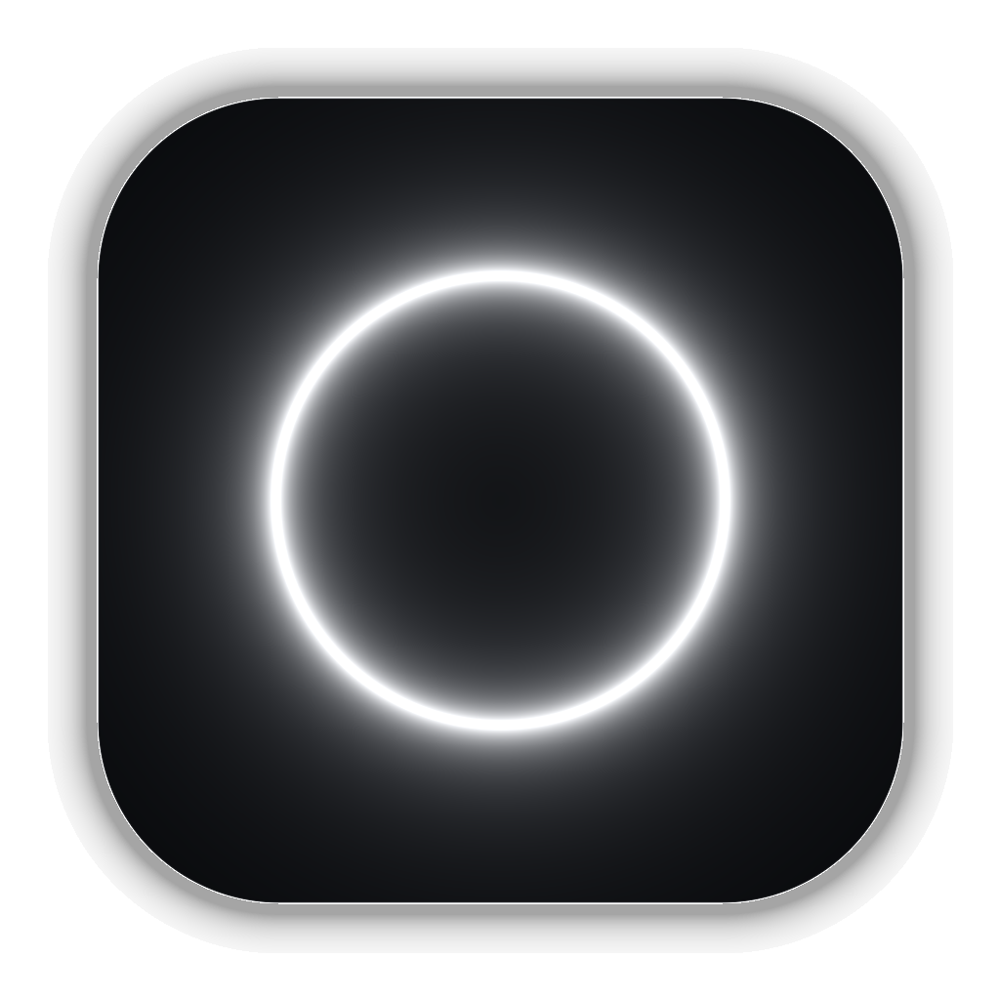
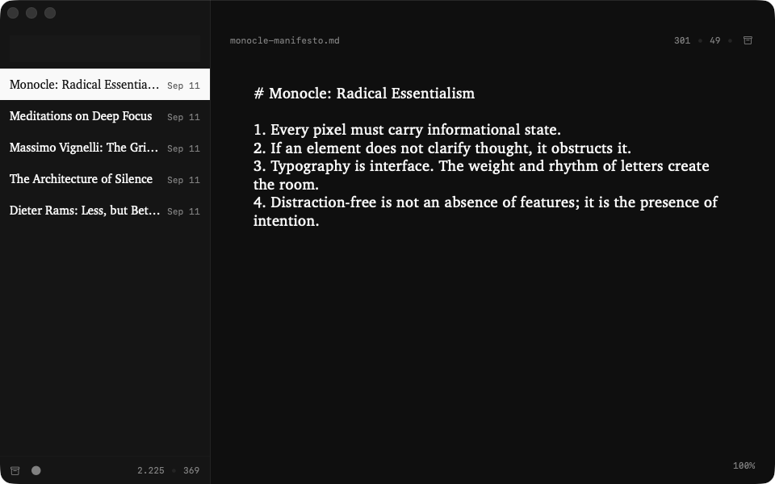
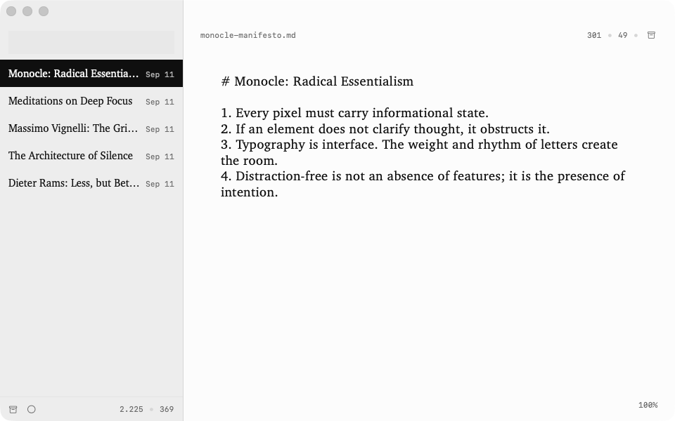
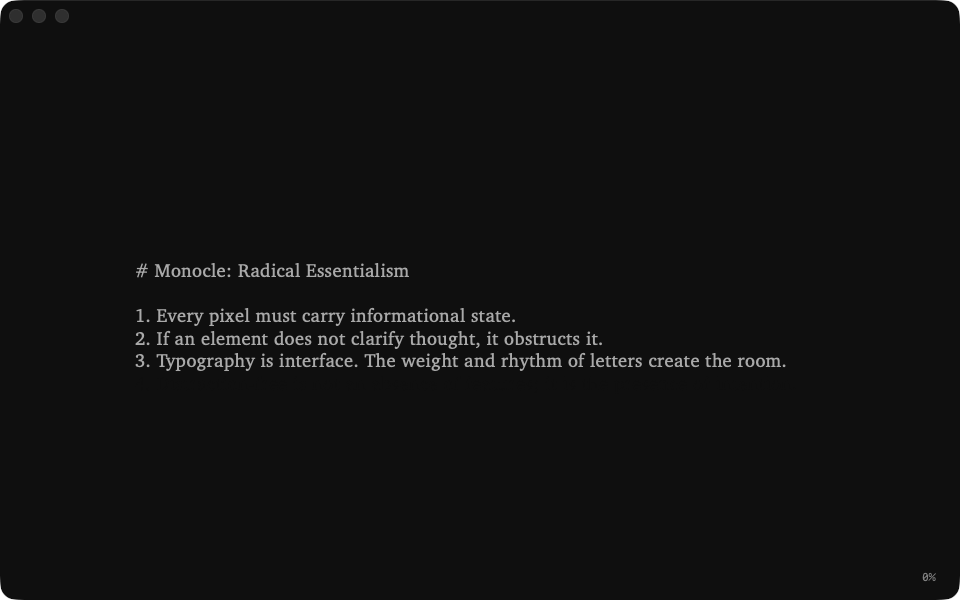
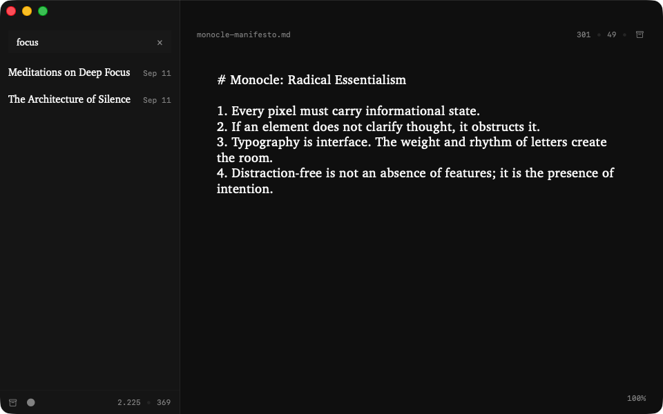

<div align="center">

# WRITO

### as minimal as possible markdown writing app for macos

[](https://github.com/lowgame/writo/releases/latest)
[](https://github.com/lowgame/writo)
[](LICENSE)
[](https://x.com/hiimthelowgame)

<br/>

<p align="center">
  
</p>

<p align="center">
  
  
</p>
<p align="center">
  
  
</p>

*Strictly 3 colors. Zero friction. Pure typographical geometry.*

</div>

---

## Design Principles

- **Less, but better** ([Dieter Rams](https://www.vitsoe.com/us/about/good-design)): Zero formatting toolbars, bloated inspector sidebars, or distractions. Only pure thoughts, prose, and typographical focus.
- **Data-Ink Ratio** ([Edward Tufte](https://www.edwardtufte.com/books/)): Every pixel is state. Zero decorative skeuomorphism or unnecessary borders. Only the essential words and numbers.
- **Grid Discipline** ([Massimo Vignelli](https://archive.org/details/thevignellicanon)): Strict visual hierarchy, mathematically calibrated spacing, and pure monochrome harmony (`#000000`, `#8E8E93`, `#FFFFFF`).
- **Zero Friction** ([Hick's Law](https://doi.org/10.1080/17470215208416600)): Instant quick-create (`⌘N`), single-key search (`/`), automatic 20-character slugged filenames, and sub-millisecond resident launch.

---

## Features

- **Distraction-Free Canvas**: Custom AppKit text engine with centered typography, optimal line-height, and zero cursor lag.
- **Typewriter Focus Mode (`⌘T`)**: Keeps the active writing line centered on screen and dims the UI chrome for deep flow.
- **Monocle Dark & Light Modes (`⌘D`)**: Achromatic high-contrast palettes (Light, Dark, System) crafted for day and night writing.
- **Unified Quick Search & Create (`/`)**: Type `/` to search existing notes or press Enter to immediately birth a new one.
- **Live Typographic Counters (`H • K`)**: Real-time character and word counts for the active note and cumulative totals for your entire vault.
- **Non-Destructive Vault & Archive (`⌘⌫`)**: Markdown files saved directly as plain text in `~/Library/Application Support/Writo/`. Soft archive with instant restore.
- **Featherweight Native Architecture**: 100% native Swift, SwiftUI & AppKit. Zero third-party dependencies. Under 2 MB binary.

---

## Shortcuts

| Shortcut | Action |
| :--- | :--- |
| `⌘N` | New note |
| `⌘T` | Toggle Typewriter Focus Mode |
| `⌘D` | Toggle Dark / Light theme |
| `⌘B` | Toggle Sidebar |
| `/` | Quick search or create note |
| `⌘⌫` | Archive note (two-click armed) |
| `⌥⌘Z` | Restore archived note |
| `⌘Z` / `⌘⇧Z` | Undo / Redo |

---

## Installation

Download **[writo.dmg](https://github.com/lowgame/writo/releases/latest)**, drag **Writo.app** to `/Applications`, and open.

*(If macOS shows an unnotarized app prompt on first launch, right-click `Writo.app` and select **Open**).*

```bash
# Or build from source
git clone https://github.com/lowgame/writo.git && cd writo && swift build -c release
```

---

## Author & License

Created by **Ahmet Kamer** — [@hiimthelowgame](https://x.com/hiimthelowgame) on X · [@lowgame](https://github.com/lowgame) on GitHub.  
Released under the [MIT License](LICENSE).
